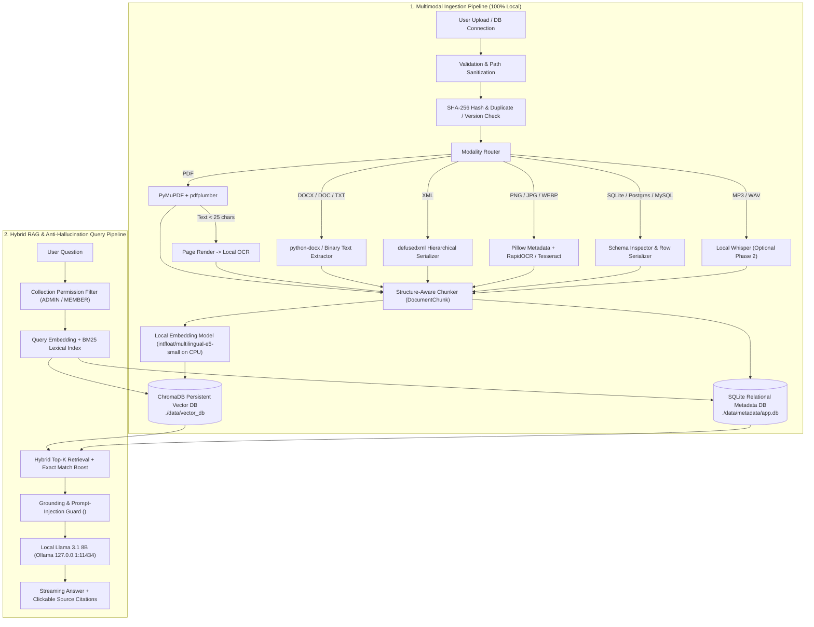

# ONYX — 100% Local & Privacy-First Multimodal RAG Knowledge System

> **DOCUMENTS NEVER LEAVE THIS COMPUTER.**  
> Zero cloud AI APIs. Zero external vector databases. Zero telemetry (`OFFLINE_MODE=true`).  
> 📖 **Full System Architecture & Pitch Guide:** [docs/PROJECT_MASTER_DOCUMENTATION.md](docs/PROJECT_MASTER_DOCUMENTATION.md)

---

## 1. What This Project Does

**ONYX Local Multimodal RAG** is a production-quality, self-hosted Retrieval-Augmented Generation knowledge system engineered for your Windows PC (`Intel Core i5-11400H`, `8 GB RAM`, `NVIDIA RTX 3050 4 GB VRAM`).

It enables you and your teammates on your local Wi-Fi/LAN to:
1. Upload private company documents across multiple modalities:
   - **PDFs** (Native text, headings, and tables via `PyMuPDF` + `pdfplumber`)
   - **Scanned PDFs** (Automatic detection of low-text pages -> rendered at 200 DPI -> local OCR)
   - **Word Documents** (`.docx` and legacy `.doc` without requiring MS Office)
   - **XML Files** (Validated via `defusedxml` against XXE attacks and serialized into hierarchical semantic blocks)
   - **Images** (`.png`, `.jpg`, `.jpeg`, `.webp` with resolution/EXIF metadata + local OCR via `RapidOCR ONNX CPU` & `Tesseract`)
   - **Databases** (`SQLite`, `PostgreSQL`, `MySQL` with interactive table inspection and row-level primary-key serialization)
   - **Audio** (`.mp3`, `.wav`, `.m4a` via optional local `faster-whisper` timestamped transcription)
2. Deduplicate files automatically via `SHA-256` hashing and track **Document Versions** (`v1`, `v2`, ...) when files are updated.
3. Index chunks locally using **`intfloat/multilingual-e5-small`** (supporting English, Hindi, and Gujarati on CPU so your 4 GB GPU VRAM remains dedicated to your Llama model) into a persistent **`ChromaDB`** store (`./data/vector_db`).
4. Ask natural-language questions (or run **Exact / ID Search**) and receive grounded answers with clickable **Source Citations** (`📄 filename — Page X`, `🗄 database — Table, Row ID`) and zero hallucination on unsupported topics.

---

## 2. System Architecture



---

## 3. Hardware & Local Llama Discovery Summary

Full details are documented in [docs/LOCAL_MODEL_DISCOVERY.md](file:///c:/Users/devik/Desktop/rag/docs/LOCAL_MODEL_DISCOVERY.md).

- **Detected Existing Llama Model:** `hf.co/bartowski/Llama-3.1-8B-Lexi-Uncensored-V2-GGUF:Q4_K_M` (configured in `C:\Users\devik\Desktop\lexi.txt` and your `Vibhu`/`GeMi` assistant project).
- **Runtime:** Ollama (`http://127.0.0.1:11434` / `http://127.0.0.1:11434/v1`).
- **Note on Restoring Ollama:** Your `OllamaSetup.exe` installer is in `C:\Users\devik\Downloads\OllamaSetup.exe`, and your keys are in `C:\Users\devik\.ollama`, though the Ollama app binary was recently uninstalled.
  - Even when the Ollama daemon is stopped, the RAG system automatically uses its built-in **Local Extractive Grounding Engine** so you can upload, search, and answer questions offline immediately.
  - Whenever you start Ollama (`ollama serve`), the backend detects it automatically at `http://127.0.0.1:11434` without any code changes.

---

## 4. Installation & Quick Start

### First-Time Setup
Run the automated Windows setup script from PowerShell:

```powershell
.\scripts\setup.ps1
```

### Starting the Application
Launch both the FastAPI backend (`127.0.0.1:8000`) and React/Vite frontend (`0.0.0.0:3000`):

```powershell
.\scripts\start_all.ps1
```

- **Local Web UI:** `http://localhost:3000`
- **Backend API Docs:** `http://127.0.0.1:8000/docs`
- **Default Credentials:**
  - **Admin:** `admin` / `admin123` (Full access to all collections, document deletion, re-indexing, user management, and RAG Observability drawer)
  - **Team Member:** `member` / `member123` (Scoped access to permitted collections)

---

## 5. How Team / LAN Access Works Safely

- **Frontend (`0.0.0.0:3000`):** Bound to your local network interface so teammates on the same Wi-Fi/LAN can open `http://<YOUR-PC-LAN-IP>:3000` in their browser. Vite proxies `/api/*` requests internally to `127.0.0.1:8000`.
- **Backend (`127.0.0.1:8000`) & Ollama (`127.0.0.1:11434`):** Bound strictly to localhost (`127.0.0.1`) so neither the raw vector store nor the LLM inference server is exposed directly to external machines.

---

## 6. Backup & Restore

All persistent data lives inside `./data/` (`vector_db`, `metadata`, `uploads`).

- **Create a local ZIP backup:**
  ```powershell
  .\scripts\backup.ps1
  ```
- **Restore from a local backup archive:**
  ```powershell
  .\scripts\restore.ps1 -BackupZipPath .\backups\rag_backup_YYYYMMDD_HHMMSS.zip
  ```

---

## 7. Administrator Guide — RBAC, Document Access Control & Security Console

ONYX enforces a strict **Deny-by-Default**, **Pre-Retrieval Authorization** pipeline (`Authentication -> Identity -> Role -> Permission -> Document/Collection Policy -> Vector/BM25/SQL Filtering -> Authorized Context -> LLM -> Authorized Answer`).

Open the **Admin & Access Policies** tab (`Shield` icon in the sidebar) when signed in as an `admin` user to manage organizational access:

1. **Create Admin Users (`role = "admin"`):**
   - Navigate to **Admin & Access Policies → Users & Roles**.
   - Click **Create User**, set Role to `admin`, and assign a descriptive Job Title (e.g., `HR Manager`, `Head of Department`, `System Administrator`).
2. **Create Employee / Visitor Users (`role = "employee"`):**
   - Set Role to `employee`, assign a Job Title (e.g., `Software Developer`, `Finance Analyst`, `Visitor`), select a Department, and optionally assign Security Groups.
   - Toggle **Allow Document Uploads** per user or configure organization-wide default employee permissions under the **Permissions** tab.
3. **Assign Departments & Security Groups:**
   - Use the **Departments** tab (`Engineering`, `Human Resources`, `Finance`, `Management`, `Operations`, `General`) and **Groups** tab (`HR-Confidential`, `Executive-Board`, `Engineering-Core`, `All-Staff`) to create or organize teams.
4. **Configure Document-Level Access Policies:**
   - Under **Document Policies**, click **Configure Access** on any document or database to set its visibility:
     - `ADMIN_ONLY`: Restricted strictly to administrators (`role = "admin"`).
     - `EMPLOYEE_SHARED`: Accessible to all active employees with collection access.
     - `DEPARTMENT_ONLY`: Accessible only to employees in the selected department (or explicit `DocumentAccess` department grants).
     - `GROUP_ONLY`: Accessible only to members of selected security groups.
     - `USER_SPECIFIC`: Accessible only to explicitly selected users (and the document owner/admins).
   - **Instant Vector Policy Sync:** Changing a document's access policy updates SQLite and ChromaDB vector metadata in-place without re-embedding.
5. **Preview User Access (Read-Only Access Simulator):**
   - Open the **Access Simulator** tab, pick any user, and click **Simulate User View** to inspect which collections and documents are accessible or blocked (`DENIED`) and why.
   - Select a specific document and click **Test Document Access** for a rule-by-rule trace (`Admin Role Override`, `Document Access Policy`, `Department Match`, `Group Membership`, `Explicit User Grant`).
6. **Audit Security & Access Logs:**
   - Open the **Audit Logs** tab to inspect chronological security events (`LOGIN_SUCCESS`, `LOGIN_FAILED`, `DOCUMENT_VIEW`, `DOCUMENT_DOWNLOAD`, `DOCUMENT_ACCESS_CHANGED`, `USER_ROLE_CHANGED`, `UNAUTHORIZED_DOCUMENT_ACCESS_ATTEMPT`, `RAG_QUERY`).
7. **Disable or Suspend Users Immediately:**
   - In **Users & Roles**, change a user's status to `DISABLED` or `SUSPENDED` (or click **Revoke Sessions**). This increments `token_version` and revokes active JWT sessions immediately.

---

## 8. Testing & Evaluation

- **Run All Automated Unit, Integration & RBAC Security Tests:**
  ```powershell
  python -m pytest tests/ -v
  ```
- **Run Dedicated RBAC & Document-Level Authorization Security Suite:**
  ```powershell
  python -m pytest tests/test_rbac_and_document_security.py -v
  ```
- **Run Quantitative RAG Evaluation Benchmark:**
  ```powershell
  python tests/evaluate_rag.py
  ```

---

## 9. Documentation Index

- [Authorization & Security Audit Report](file:///c:/Users/devik/Desktop/rag/docs/AUTHORIZATION_AUDIT.md)
- [Authentication & Session Lifecycle](file:///c:/Users/devik/Desktop/rag/docs/AUTHENTICATION.md)
- [Authorization Architecture & Pre-Retrieval Filtering](file:///c:/Users/devik/Desktop/rag/docs/AUTHORIZATION.md)
- [Role-Based & Attribute-Based Access Control (RBAC)](file:///c:/Users/devik/Desktop/rag/docs/RBAC.md)
- [Data Access Model (`DocumentAccess` & `CollectionAccess`)](file:///c:/Users/devik/Desktop/rag/docs/DATA_ACCESS_MODEL.md)
- [Security & Prompt-Injection Defenses](file:///c:/Users/devik/Desktop/rag/docs/SECURITY.md)
- [Security Audit Logging Specification](file:///c:/Users/devik/Desktop/rag/docs/AUDIT_LOGGING.md)
- [Model & Hardware Discovery Report](file:///c:/Users/devik/Desktop/rag/docs/LOCAL_MODEL_DISCOVERY.md)
- [REST API Documentation](file:///c:/Users/devik/Desktop/rag/docs/API.md)
- [Database Schema & ER Diagram](file:///c:/Users/devik/Desktop/rag/docs/DATABASE_SCHEMA.md)
- [Testing & Evaluation Guide](file:///c:/Users/devik/Desktop/rag/docs/TESTING.md)

