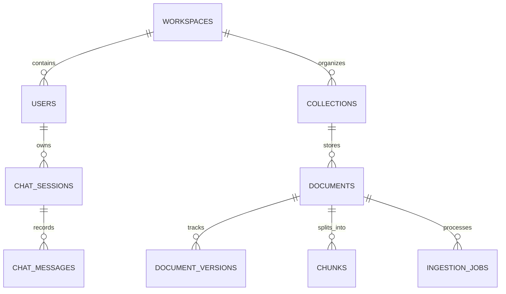

# Database Schema Documentation

The system separates storage into two local persistence layers:
1. **Relational Metadata & Conversational Store (`SQLite` at `./data/metadata/app.db`)**
2. **Persistent Vector Database (`ChromaDB` at `./data/vector_db`)**

---

## 1. Entity-Relationship Diagram

---

## 2. Relational Tables (`SQLite`)

### `workspaces`
- `id` (PK, UUID)
- `name` (Unique String, default `"ONYX"`)
- `description` (Text)
- `created_at` (DateTime)

### `users`
- `id` (PK, UUID)
- `username` (Unique String, indexed)
- `password_hash` (Argon2id hash — plaintext passwords are never stored)
- `role` (`"ADMIN"` or `"MEMBER"`)
- `workspace_id` (FK -> `workspaces.id`)
- `allowed_collections_json` (JSON list of permitted collection names or `["*"]`)
- `can_upload` (Boolean)
- `created_at` (DateTime)

### `collections`
- `id` (PK, UUID)
- `name` (String, indexed — e.g. `General`, `Projects`, `Finance`, `HR`, `Research`, `Product`, `Engineering`)
- `description` (Text)
- `workspace_id` (FK -> `workspaces.id`)
- `is_private` (Boolean)
- `allowed_roles_json` (JSON)
- `created_by` (String)
- `created_at` (DateTime)

### `documents`
- `id` (PK, UUID)
- `filename` (Sanitized filename)
- `original_filename` (Original upload filename)
- `file_type` (Extension, e.g. `.pdf`, `.docx`, `.xml`, `.jpg`, `.db`)
- `modality` (`pdf`, `scanned_pdf`, `docx`, `xml`, `image`, `database`, `audio`, `text`)
- `file_path` (Local path on disk)
- `file_size` (Bytes)
- `content_hash` (SHA-256 hex digest, indexed)
- `version` (Integer, increments automatically when same filename is uploaded with a new SHA-256 hash)
- `collection_id` (FK -> `collections.id`)
- `collection_name` (String, indexed)
- `workspace_id` (FK -> `workspaces.id`)
- `owner` (Username)
- `status` (`Uploaded`, `Extracting`, `OCR`, `Chunking`, `Embedding`, `Indexing`, `Ready`, `Failed`)
- `chunk_count` (Integer)
- `page_count` (Integer)
- `error_message` (Text, nullable)
- `suggested_action` (Text, nullable)
- `metadata_json` (JSON)
- `created_at`, `updated_at` (DateTime)

### `document_versions`
- `id` (PK, UUID)
- `document_id` (FK -> `documents.id`)
- `version` (Integer)
- `content_hash` (SHA-256 hex digest)
- `file_path` (Text)
- `file_size` (Integer)
- `chunk_count` (Integer)
- `status` (String)
- `created_at` (DateTime)

### `chunks`
- `id` (PK, String `{document_id}_v{version}_c{index}`)
- `document_id` (FK -> `documents.id`)
- `version` (Integer)
- `chunk_index` (Integer)
- `content` (Text)
- `modality` (String)
- `page_number` (Integer)
- `section_title` (String)
- `collection_name` (String, indexed)
- `content_hash` (SHA-256)
- `metadata_json` (Full JSON metadata synchronized with ChromaDB)
- `created_at` (DateTime)

### `ingestion_jobs`
- `id` (PK, UUID)
- `document_id` (FK -> `documents.id`)
- `status`, `stage` (String)
- `progress_pct` (Integer `0..100`)
- `error_message`, `suggested_action` (Text)
- `started_at`, `completed_at` (DateTime)

### `chat_sessions` & `chat_messages`
Stored strictly in SQLite (`chat_sessions`, `chat_messages`) so conversational memory never pollutes the permanent ChromaDB vector knowledge base.
